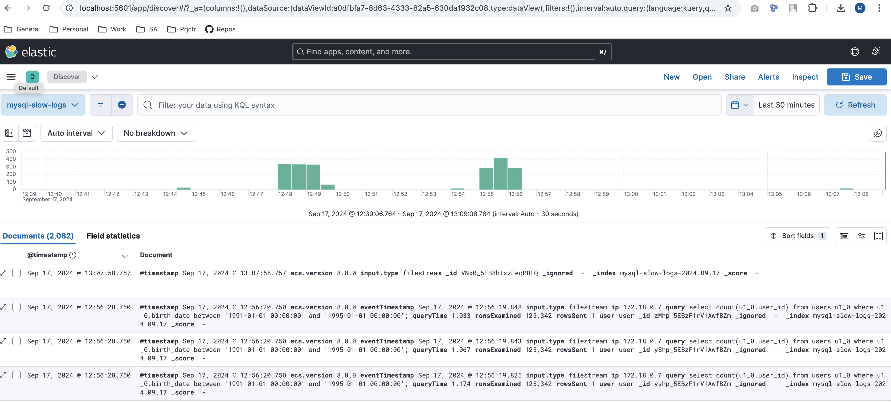
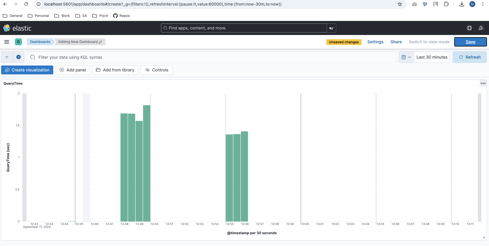
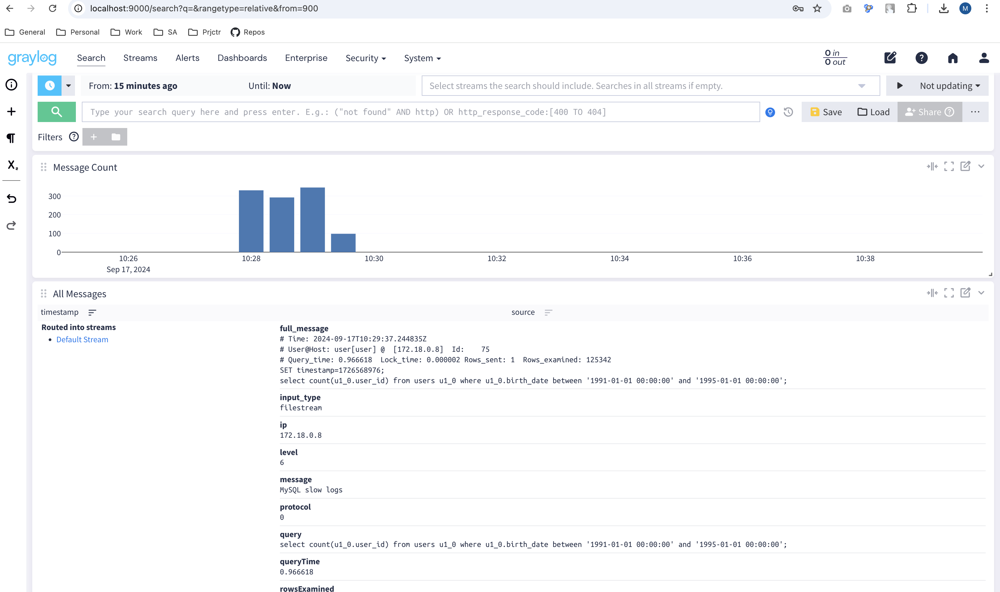
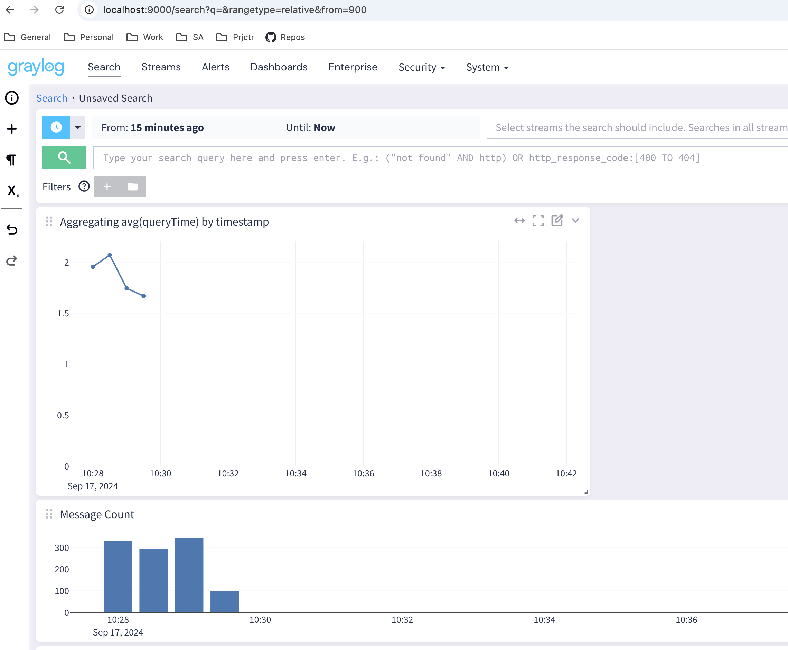
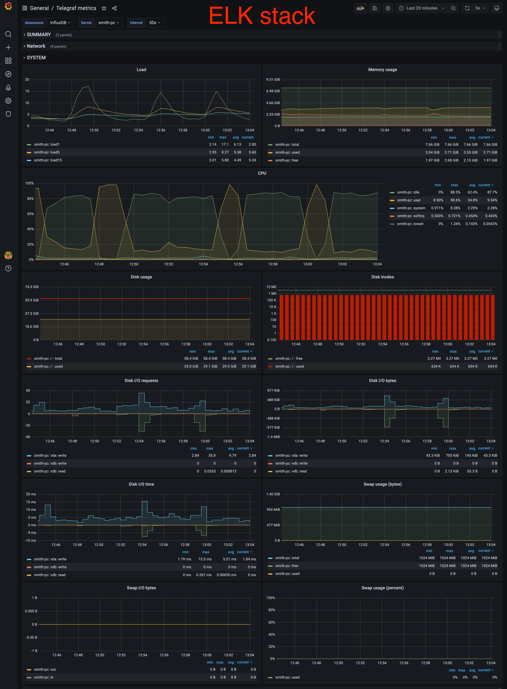
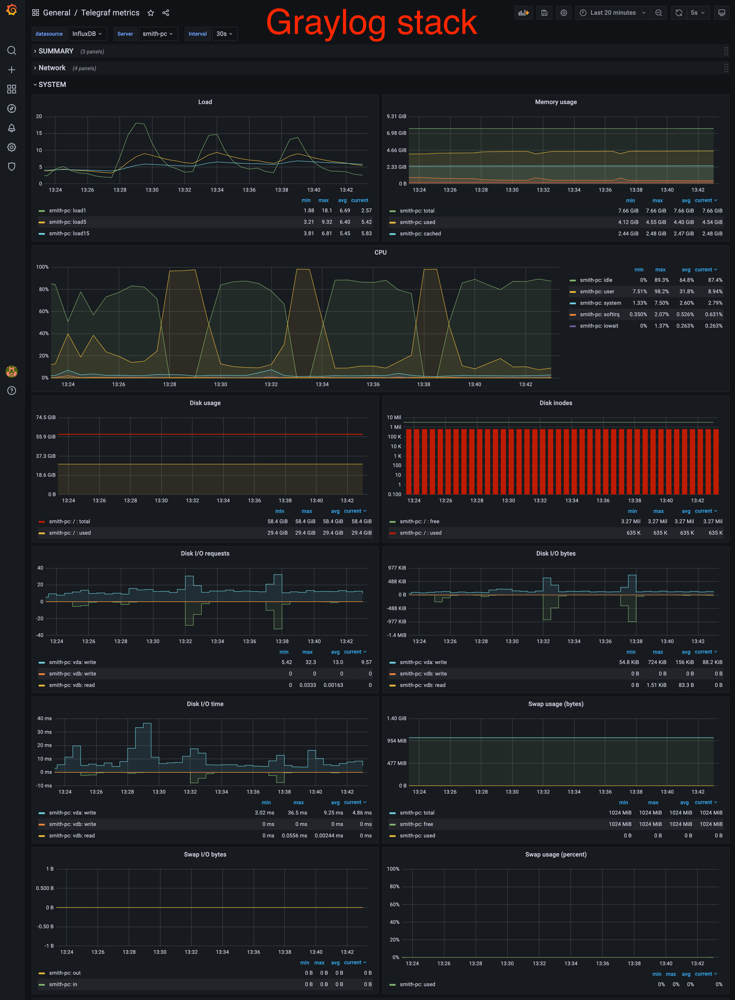

# HSA elk performance
ELK and Graylog logging stack comparison

<h3>Task</h3>

1. Collect MySQL slow query logs and ingest to ELK/Graylog for analysis.
2. Compare system resources consumption for both stacks.

<h3>Description</h3>

<h4>ELK stack</h4>

1. Filebeat monitors slow query logs, extracts each log record and sends to Logstash.
2. Logstash performs record's transformation (extracts necessary fields) and sends data to elasticsearch.
3. Logs are displayed in Kibana (already created index from Elasticsearch).

Slow log transformation result in Logstash:

```
2024-09-17 12:56:28 {
2024-09-17 12:56:28         "@timestamp" => 2024-09-17T09:56:20.750Z,
2024-09-17 12:56:28           "rowsSent" => 1,
2024-09-17 12:56:28              "query" => "select count(u1_0.user_id) from users u1_0 where u1_0.birth_date between '1991-01-01 00:00:00' and '1995-01-01 00:00:00';",
2024-09-17 12:56:28     "eventTimestamp" => "2024-09-17T09:56:19.848668Z",
2024-09-17 12:56:28              "input" => {
2024-09-17 12:56:28         "type" => "filestream"
2024-09-17 12:56:28     },
2024-09-17 12:56:28                 "ip" => "172.18.0.7",
2024-09-17 12:56:28                "ecs" => {
2024-09-17 12:56:28         "version" => "8.0.0"
2024-09-17 12:56:28     },
2024-09-17 12:56:28          "queryTime" => 1.033429,
2024-09-17 12:56:28       "rowsExamined" => 125342,
2024-09-17 12:56:28               "user" => "user"
2024-09-17 12:56:28 }
```




<h4>Graylog stack</h4>

1. Filebeat monitors slow query logs, extracts each log record and sends to Logstash.
2. Logstash performs record's transformation (extracts necessary fields) and sends data to Graylog.
3. Logs are stored in Opensearch and displayed in Graylog.




<h4>System's resources consumption</h4>

Metrics collected with ``long_query_time = 0, 1, 10 sec``




Conclusions: <br/>

Graylog stack is more aggressive to memory consumption, other params look similar.
